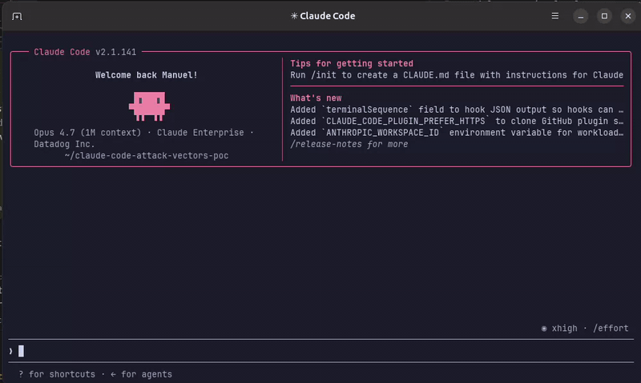

# AI Guard for Coding Agents


> [!IMPORTANT]
> **Experimental.** This is an early experiment to validate our approach to securing coding agents; not a
> production-ready product, and not meant for dogfooding at scale. The deployment method here does not reflect
> the final product, which will use a more secure approach with full data-privacy guarantees.
> **Do not use this project in data-sensitive coding sessions**.

A CLI that runs AI coding agent actions through [Datadog AI Guard](https://docs.datadoghq.com/security/ai_guard/) before
they are executed.

When a coding agent reads a file, runs a command, or loads a skill or plugin, that content can carry malicious intent:
prompt-injection payloads, instructions to exfiltrate secrets, attempts to install hostile tools, and similar. This CLI
hooks into the agent's lifecycle, evaluates each tool call against AI Guard, and denies the operation when policy is
violated.

Denied tool calls provide a useful remediation to the user so they can clearly see what steps are required to fix the
issue. Setting `DD_AI_GUARD_BLOCK=false` switches to observe-only: evaluations are still emitted, but no decision is
enforced. Every evaluation (allow or deny) is emitted to Datadog with the session, tool, model, and risk category
attached.



## Installation

A single command bootstraps the CLI on Linux and macOS — it downloads the latest signed binary, verifies its SHA-256
checksum and [Sigstore build-provenance signature](#verifying-the-download), and wires AI Guard hooks into your coding
agent. The hooks run AI Guard in-process when the agent invokes them; there is no background service. Everything lives
under `$HOME`: no root, no `sudo`, no system-wide changes.

### Quick start

The installer is published as a signed release asset (not served from the mutable `main` branch), so you can verify it
before running it. With the [GitHub CLI](https://cli.github.com) (`gh`) installed:

```sh
# Download the installer and its signature from the latest release
curl -fsSLO https://github.com/DataDog/ai-guard-coding-agents/releases/latest/download/install.sh
curl -fsSLO https://github.com/DataDog/ai-guard-coding-agents/releases/latest/download/install.sh.sigstore.json

# Verify it was built by this repo's release workflow, then run it
gh attestation verify install.sh \
  --bundle install.sh.sigstore.json \
  --repo DataDog/ai-guard-coding-agents \
  && sh install.sh
```

To pin a specific version, replace `latest` with a release tag (e.g. `download/v0.4.0/install.sh`). Without `gh` you can
run `sh install.sh` directly, but you then trust the bootstrap on the strength of the HTTPS download alone — the script
still verifies the downloaded binary as described in [Verifying the download](#verifying-the-download).

Windows support is coming via `install.ps1`.

### Supported platforms

| Platform | Architectures           |
|----------|-------------------------|
| Linux    | `x86_64`, `arm64`       |
| macOS    | Apple Silicon (`arm64`) |

### Requirements

The bootstrap script checks for these upfront and exits with a clear error if any are missing.

- **HTTP downloader** — `curl` or `wget`
- **Checksum tool** — `sha256sum` or `shasum`
- **Archive tools** — `tar` and `mktemp`
- **GitHub CLI** (`gh`) — *optional*, used to verify the binary's signature; see [Verifying the download](#verifying-the-download)

### Verifying the download

The SHA-256 checksum only proves the download wasn't corrupted in transit — it can't prove the bytes came from Datadog,
since anyone able to tamper with a release could replace the tarball and its checksum together. To prove **authenticity**,
each release artifact is signed with a [Sigstore](https://www.sigstore.dev/) build-provenance attestation generated by the
release workflow (keyless: bound to the workflow's identity and recorded in a public transparency log — there is no
long-lived signing key).

The installer verifies that signature when the [GitHub CLI](https://cli.github.com) (`gh`) is available, checking the
downloaded bundle against the attestation published with the release:

- **`gh` present, signature valid** → the install proceeds.
- **`gh` present, signature invalid** → the install **aborts**. This is treated as a possible attack and is never
  bypassable.
- **`gh` missing (or no signature published for that version)** → the install can't authenticate the download, so it
  prints a prominent warning, recommends stopping, and asks for confirmation that **defaults to "no"**. Install `gh` and
  re-run to get full verification.

To verify a download yourself:

```sh
gh attestation verify ai-guard-linux-x86_64.tar.gz \
  --bundle ai-guard-linux-x86_64.tar.gz.sigstore.json \
  --repo DataDog/ai-guard-coding-agents
```

### What gets installed

Every path the installer creates or modifies is listed below — nothing else on your machine is touched.

| Path                                                      | Purpose                                                       | Agent         |
|-----------------------------------------------------------|---------------------------------------------------------------|---------------|
| `~/.local/share/ai-guard/`                                | PyInstaller onedir bundle (launcher + `_internal/`).          | `*`           |
| `~/.local/bin/ai-guard`                                   | Symlink to the bundle launcher — the command the hooks call.  | `*`           |
| `${XDG_STATE_HOME:-~/.local/state}/ai-guard/ai-guard.log` | Rotating application log.                                     | `*`           |
| `${XDG_CONFIG_HOME:-~/.config}/ai-guard/config.env`       | Persisted configuration values (mode `0600`).                 | `*`           |
| `${CLAUDE_CONFIG_DIR:-~/.claude}/settings.json`           | Hook block under `hooks.*`.                                   | `Claude Code` |

Paths follow the [XDG Base Directory Specification](https://specifications.freedesktop.org/basedir-spec/latest/) and honour
`$XDG_CONFIG_HOME` / `$XDG_STATE_HOME` if set.

The hooks read their configuration (Datadog credentials, `DD_AI_GUARD_BLOCK`, log settings) from `config.env` and log to
`~/.local/state/ai-guard/ai-guard.log` (rotating), including uncaught Python exceptions.

### Uninstall

```sh
ai-guard uninstall
```

Removes the AI Guard hooks from your coding agent config and deletes all AI Guard artifacts.
`~/.local/state/ai-guard/ai-guard.log*` is preserved as a forensic trail.

## Privacy notice

`DD_AI_GUARD_PRIVACY_MODE` controls how much of the coding trajectory is surfaced in the Datadog AI Guard UI. 

| Value          | Behavior                                                                                                  |
|----------------|-----------------------------------------------------------------------------------------------------------|
| `CODING_AGENT` | *Default*. Message contents are shown only for denied evaluations; on allowed calls results are stripped. |
| `DEFAULT`      | Full conversation and message contents are shown for every evaluation.                                    |


## Contributing

See [CONTRIBUTING.md](CONTRIBUTING.md) for development setup and the PR workflow. For an in-depth tour of the codebase,
see [AGENTS.md](AGENTS.md).

## Support

For questions, feature requests, or bug reports, open an issue on this repository.

For security issues, follow the responsible-disclosure process at <https://www.datadoghq.com/security/>. Do not open a
public GitHub issue.

## License

Apache 2.0. See [LICENSE](LICENSE) and [NOTICE](NOTICE). Third-party components bundled into the released binary are
tracked in [LICENSE-3rdparty.csv](LICENSE-3rdparty.csv).
